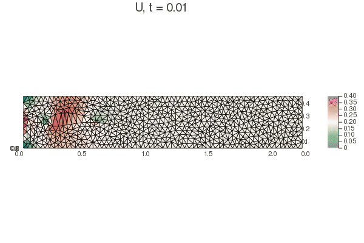

Se resolvieron las ecuaciones de Navier-Stokes para las condiciones de frontera equivalentes a un túnel de viento rectangular. Los detalles matemáticos pueden consultarse en el [reporte del proyecto](https://sayeg84.github.io/windTunnel/).  Fuera de la triangulación del dominio, todo el código se programó desde cero en el lenguaje Julia. Se puede acceder al código del proyecto en su [repositorio de github](https://github.com/sayeg84/windTunnel).

Este proyecto fue parte de un curso final

Para un obstáculo circular, no hay mucha estabilidad:

Mientras que una ala de Joujowsky presenta muy buena estabilidad:

