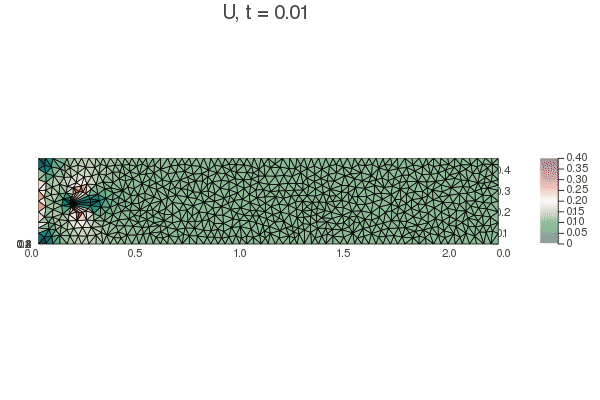

I made a program to solve the Navier-Stokes equations for a case with boundary conditions equivalent to a rectangular wind tunnel. Mathematical details can be reviewd in the [project report](https://sayeg84.github.io/windTunnel/) and the code is [available on GitHub](https://github.com/sayeg84/windTunnel).

A simple GIF of the simulation for a circular obstacle:

And a Joukowsky wing:

